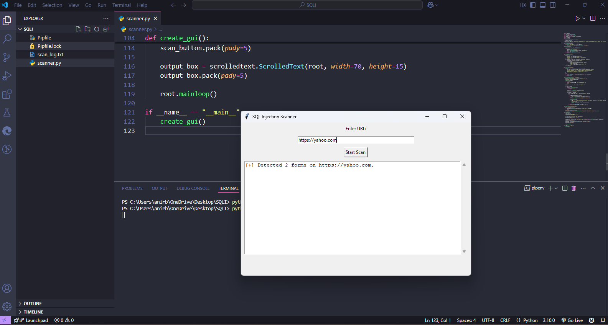
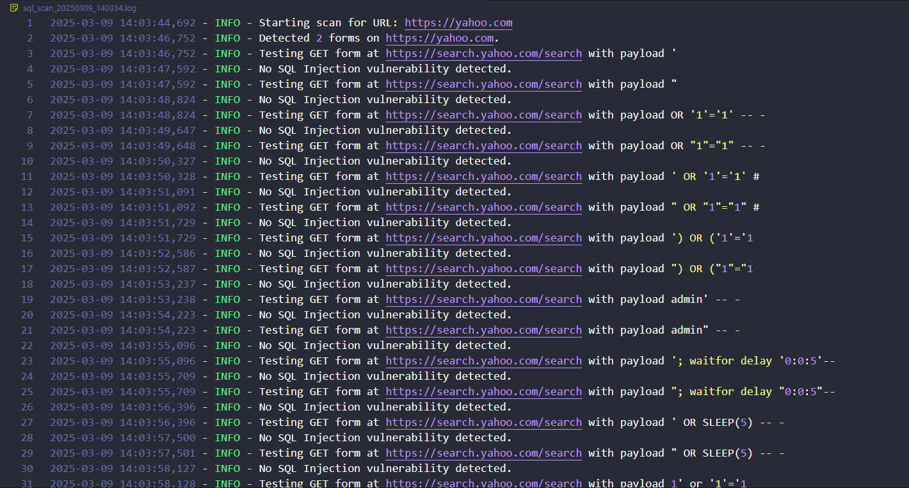
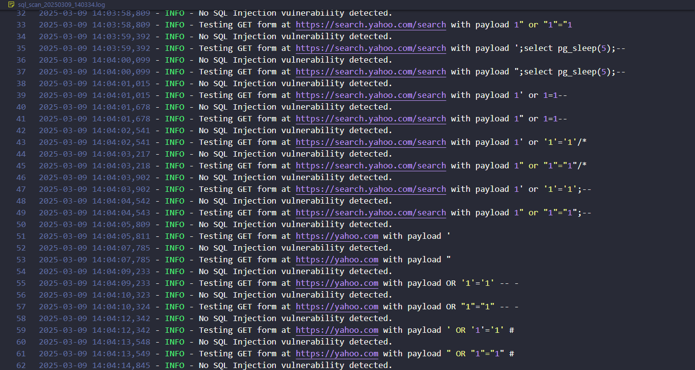
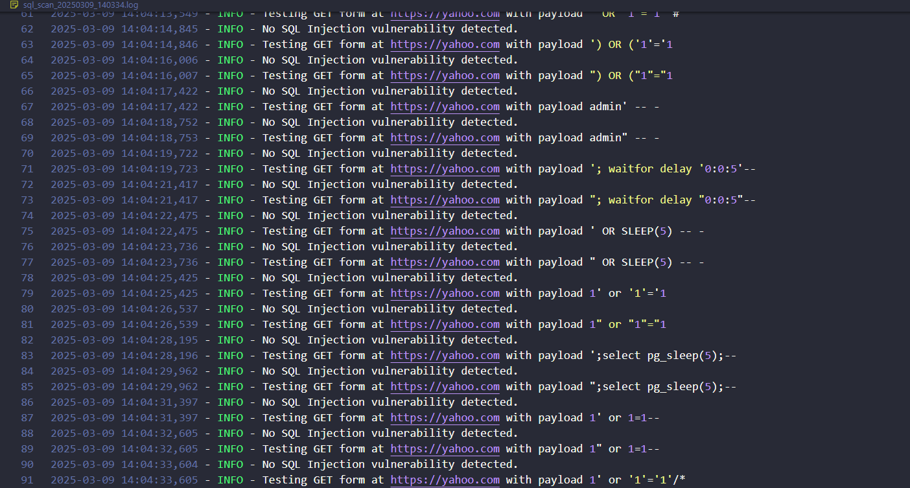
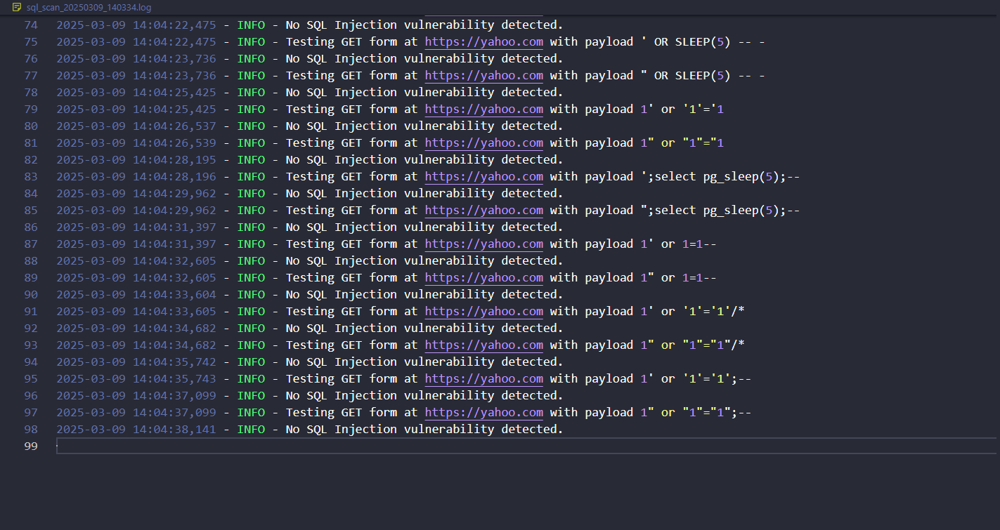

# 🛡️ SQL Injection Scanner

    

A powerful **SQL Injection Scanner** built using Python, designed to detect vulnerabilities in web forms. This project automates SQL injection testing, provides real-time logs, and generates detailed reports for analysis.

---

## ✨ Features
- 🔍 **Automated SQL Injection Scanning** for web forms
- 🎨 **GUI Interface** built with Tkinter
- ⚡ **Multithreaded Execution** for faster scanning
- 📊 **Excel Report Generation** with OpenPyXL
- 📡 **Web Scraping** to detect vulnerable forms (BeautifulSoup)
- 📈 **Data Visualization** of scan results (Matplotlib)
- 📜 **Logging System** for detailed tracking of scan activities

---

## 🖥️ Tech Stack
- **Programming Language:** Python
- **Libraries Used:**
  - `tkinter` – GUI development
  - `requests` – HTTP request automation
  - `BeautifulSoup` – Web scraping
  - `openpyxl` – Excel report generation
  - `matplotlib` – Data visualization
  - `threading` – Multithreading for performance

---

## 📸 Screenshots
### 🔵 Main Interface



### 🟢 Scan Results






## 🚀 Installation & Usage
### 🔧 Prerequisites
Ensure you have **Python 3.9+** installed.

### 📥 Installation
```sh
# Clone the repository
git clone https://github.com/your-username/sql-injection-scanner.git
cd sql-injection-scanner

# Install dependencies
pip install -r requirements.txt
```

### ▶️ Running the Scanner
```sh
python main.py
```

---

## 🛠️ How It Works
1. **Enter the Target URL** into the scanner.
2. **Scan for vulnerable forms** using the automated web scraper.
3. **Inject SQL payloads** into detected input fields.
4. **Analyze the response** for possible SQL injection vulnerabilities.
5. **View real-time logs** and generate an Excel report for security assessment.

---

## ⚠️ Disclaimer
This tool is intended for **educational and ethical security testing purposes only**. Do not use it on unauthorized websites.

---

## 🤝 Contributing
Feel free to submit **issues** and **pull requests** to improve this project! 🚀

---

## 📜 License
This project is licensed under the **MIT License**.

---

## 📞 Contact
📧 Email: [2003anirbanghosh@gmail.com](mailto:2003anirbanghosh@gmail.com)  
🐙 GitHub: [AnirbanGhosh2503](https://github.com/AnirbanGhosh2503)  

---

### 🌟 Don't forget to **star** this repository if you find it useful! ⭐

